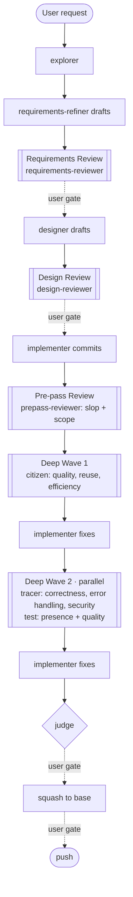
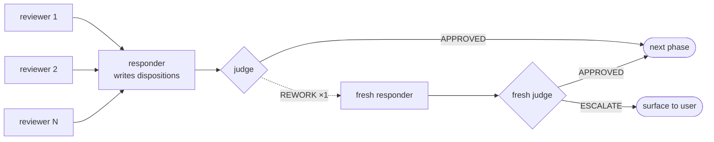

# claude-plugins

A Claude Code plugin marketplace with two plugins for opinionated, review-driven engineering workflows.

The overall goal is token-efficient agentic coding with human review (and very little human authoring) with a priority on high quality results.
It also prioritizes not wasting the human reviewer's time with complete slop.
As such there's a strong emphasis on multiple agentic review passes (with specialist reviewers) that go before each human review gate.
This is not token-*cheap* with all the review passes but a lot of effort has been put into reducing token usage without sacrificing quality or wasting the human's time.

The key to reducing token usage seems to be keeping each agent lifetime short.
The context-establishment cost vs context-carrying cost crossover seems to be quite early.
(Meaning: After the crossover point, you're better off starting a new agent instance from scratch and paying the cost of it re-establishing context.)
There's some [anecdotal usage data](docs/usage-analysis/README.md) gathered using various versions of this workflow that might be of interest.

## Plugins

- **[review-chain](plugins/review-chain/)** — Orchestrator-driven workflow with adversarial review chains. A thin pre-pass reviewer (slop + scope) gates a deep pass that runs in sequential waves — citizen (quality, reuse, efficiency), then tracer (correctness, error handling, security) + test over the code including the first wave's fixes; a responder fact-checks and fixes after every wave; a judge adjudicates dispositions and scans the fixes no reviewer saw. Requirements and design each get an adversarial review with the same review → respond → adjudicate pattern before the corresponding user gate. All agents are one-shot, file-based, and token-frugal — the orchestrator consumes only short summaries and paths.
- **[setup-project](plugins/setup-project/)** — Optional bootstrap that wires the orchestrator as the default agent, adds a generic Working-With-Claude-Code section to `CLAUDE.md`, and installs a `TODO.md` + `TODO(slug)` tracking convention. Take it or leave it — `review-chain` works without it.

## How review-chain works

The orchestrator drives explore → refine → design → implement → review → ship. Authoring is sequential with explicit user gates. Four review phases — requirements, design, pre-pass, deep — share the same review → respond → adjudicate pattern, with at most one rework round before APPROVED or ESCALATE. Squash and push are separate user gates at the end.



Each `[[boxed]]` review phase expands to the same review → respond → adjudicate loop. The responder is the requirements-refiner (requirements phase), the designer (design phase), or the implementer (pre-pass and deep):



Reviewers (one-shot, fresh each phase) write notes files; the responder reads the notes and marks each finding **Fixed**, **TODO(slug)** (self-scoring the judge's TODO rubric), or **Won't-Do**; the judge reads the notes, the dispositions, and the diff (or the design / refined request), scans any respond commits no reviewer saw, and decides APPROVED / REWORK / ESCALATE based on the consequence text in each finding. One rework round max per phase — round 2 returns either APPROVED or ESCALATE. Reviewers can also ESCALATE directly mid-phase (e.g., the prepass-reviewer flagging a bait-and-switch on scope) without going through the judge.

The deep pass is sequential on purpose: the citizen wave's structural findings get fixed before the tracer's adversarial bug-hunt reads the code, so the deepest review runs on near-final code and each wave's fixes are reviewed by the next wave (the judge covers the last one). Implementation itself is incremental — rounds of up to 5 commits, each round reviewed over just its own commits and silently squashed, with only the final `done` round reaching the human ship-gate.

For the morbidly curious — the whole thing fully expanded, every loop and every ESCALATE edge inline:

```mermaid
flowchart LR
    user([User request]) --> ex[explorer]
    ex --> rr[requirements-refiner drafts]
    rr --> rrev[requirements-reviewer]
    rrev --> rResp[requirements-refiner responds]
    rResp --> rJ{judge}
    rJ -. REWORK .-> rResp2[fresh refiner]
    rResp2 --> rJ2{fresh judge}
    rJ -- APPROVED --> rGate
    rJ2 -- APPROVED --> rGate
    rJ -- ESCALATE --> esc([surface to user])
    rJ2 -- ESCALATE --> esc

    rGate[/user gate/] --> d[designer drafts]

    d --> dr[design-reviewer]
    dr --> dResp[designer responds]
    dResp --> dJ{judge}
    dJ -. REWORK .-> dResp2[fresh designer]
    dResp2 --> dJ2{fresh judge}
    dJ -- APPROVED --> dGate
    dJ2 -- APPROVED --> dGate
    dJ -- ESCALATE --> esc([surface to user])
    dJ2 -- ESCALATE --> esc

    dGate[/user gate/] --> impl[implementer commits]

    impl --> pre[prepass-reviewer<br/>slop + scope]
    pre -. mid-phase ESCALATE .-> esc
    pre --> pResp[implementer responds]
    pResp --> pJ{judge}
    pJ -. REWORK .-> pResp2[fresh implementer]
    pResp2 --> pJ2{fresh judge}
    pJ -- APPROVED --> ci
    pJ2 -- APPROVED --> ci
    pJ -- ESCALATE --> esc
    pJ2 -- ESCALATE --> esc

    ci[citizen-reviewer<br/>quality, reuse, efficiency] --> w1Resp[implementer responds + fixes]
    w1Resp --> tr[tracer-reviewer<br/>correctness, error handling, security]
    w1Resp --> te[test-reviewer]
    tr --> w2Resp[implementer responds + fixes]
    te --> w2Resp

    w2Resp --> dpJ{judge<br/>both waves + respond-commit scan}
    dpJ -. REWORK .-> dpResp2[fresh implementer]
    dpResp2 --> dpJ2{fresh judge}
    dpJ -- APPROVED --> shipGate
    dpJ2 -- APPROVED --> shipGate
    dpJ -- ESCALATE --> esc
    dpJ2 -- ESCALATE --> esc

    shipGate[/user gate/] --> sq[squash to base]
    sq -. user gate .-> push([push])
```



## Install

```bash
# Add the marketplace (one-time, user-wide across all projects by default)
claude plugin marketplace add https://github.com/rnortman/claude-plugins.git

# Or add at project scope (shared with teammates via .claude/settings.json)
claude plugin marketplace add https://github.com/rnortman/claude-plugins.git --scope project

# Install the plugin(s)
claude plugin install review-chain@rnortman-plugins
claude plugin install setup-project@rnortman-plugins   # optional
```

Or test locally without installing into the marketplace:

```bash
claude --plugin-dir ./plugins/review-chain
```

## License

MIT — see [LICENSE](LICENSE).
