# Claude usage cost-structure analysis

# tl;dr

Take this analysis with a grain of salt, but it looks like short sessions are better than long sessions.
Slightly more formally: context *carrying* cost exceeds context *establishment* costs very quickly in agentic coding.
It is better to start from scratch and let the agent re-establish once turns get above the crossover point.
In these data the establishment vs carrying crossover point is different depending on how you look at it, but it's in the neighborhood of 50 turns, which is *very few turns* for agentic coding.
One turn = one tool use (modulo batched tool uses, which are highly beneficial but most current models are bad at doing them.)

## What this is — and isn't

**Anecdotal and observational, not experimental.** This is one user's own
Claude Code usage with whatever sessions happened to run, complete with
their confounds: model swaps, varying job sizes, evolving workflow
patterns. No controlled A/B. Many cells reduce to small N (sometimes <10
sessions); rank order between cells could flip with a few more data
points. **Treat numerical conclusions as directional and low-confidence.**

**Most plots use log-log axes.** What looks linear on the page is a power
law in the underlying data; what looks nearly flat may still be
superlinear. Read trend strength from the slope `b` in fitted
`y = a·x^b`, not from visual gradient.

### Headline takeaways (low confidence — see caveats above)

- **Cache reads dominate long-session cost.** Cache-read token volume
  scales as `turns^~1.6` across all families. Cost composition flips
  from write-dominated (short calls) to read-dominated (long calls)
  somewhere around 30–100 turns. What you load early keeps getting
  re-read.
- **Each (role × family) cell has a "split-it" crossover.** Below it
  establishment (one-time briefing) dominates per-invocation cost; above
  it carrying (recurring re-replay) does. Implementer: opus ≈56 turns,
  sonnet ≈36 turns. Other roles 40–100. For non-splittable roles this
  is descriptive — it tells you where the role *sits* relative to its
  own break-even.
- **Splitting implementer work pays at large T, not small T.** Synthetic
  model: T=300 turn job split into K≈10–15 fresh-context calls saves
  35–50%. At T=100 the predicted ~22% saving is conditional on briefings
  being cheap — ~5 extra orientation turns per split erase it.
- **Model choice (opus→sonnet) is a bigger lever than incremental vs
  monolithic orchestration.** In the workflow data the apparent
  "incremental is cheaper" signal is mostly job size and model swap, not
  orchestration mode. Within opus at matched output volume, monolithic
  and incremental cost about the same per output token.

## Cost composition flips with session length

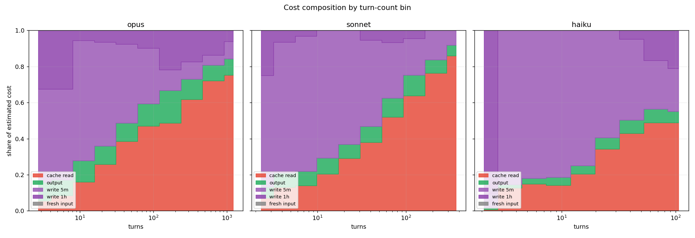

Stacked share of cost by component, binned by turn count. Short invocations
are dominated by cache writes — paying the one-time briefing cost. Long
invocations are dominated by cache reads — re-replaying the accumulated
context every turn. The crossover sits roughly 30–100 turns depending on
family. **This is the load-bearing intuition for everything below.**

## The cache-read tax

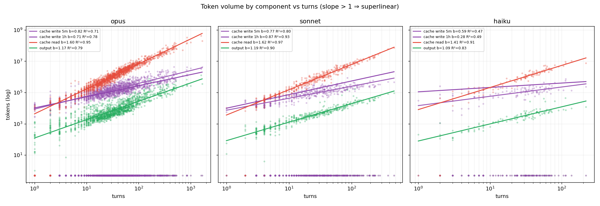

Power-law slopes for raw token volume (`volume = a · turns^b`):

| family   |   cache read |   cache write 1h |   cache write 5m |   output |
|:---------|-------------:|-----------------:|-----------------:|---------:|
| haiku    |         1.41 |             0.28 |             0.59 |     1.09 |
| opus     |         1.6  |             0.71 |             0.82 |     1.17 |
| sonnet   |         1.62 |             0.87 |             0.77 |     1.19 |

Cache reads scale as `turns^~1.6` across all families. A simple "constant
per-turn context delta, fully replayed each turn" model would predict
b = 2 (cumulative reads = K·(1+2+…+N-1) ≈ K·N²/2). Observed ~1.6 means
the *per-turn* context delta itself isn't constant — typically it shrinks
as sessions progress (early turns load big context; later turns are cheap
tool calls or short replies adding little). Cache eviction/compaction
could also contribute but isn't required to explain it. Either way the
structural fact remains: **a token added at turn 1 of a 200-turn session
gets re-read ~199 times at the cache-read rate**. Writes are sublinear
(b ≈ 0.6–0.85): once cached, the prefix grows slowly. Output is mildly
superlinear (b ≈ 1.1–1.2).

Tokenizer caveat: opus 4.7 produces up to 35% more tokens for the same
text than prior models, biasing cross-version *token-volume* comparisons
upward for opus 4.7. Cost-priced comparisons within a single invocation
are unaffected.

## Role analysis

Role buckets:

- **parent_orchestrator** — top-level session where >50% of spend goes to
  subagents (parent is delegating).
- **parent_worker** — top-level session where the parent itself does most
  of the work; structurally behaves like a subagent.
- **implementer** — review-chain implementer subagents.
- **designer** — review-chain designer subagents (excludes design-reviewer).
- **reviewer** — all reviewer subagents pooled.
- **explorer** — read-only scouts.
- **other** — general-purpose, mediator, judge, untyped, etc.

### Cost vs turns by role

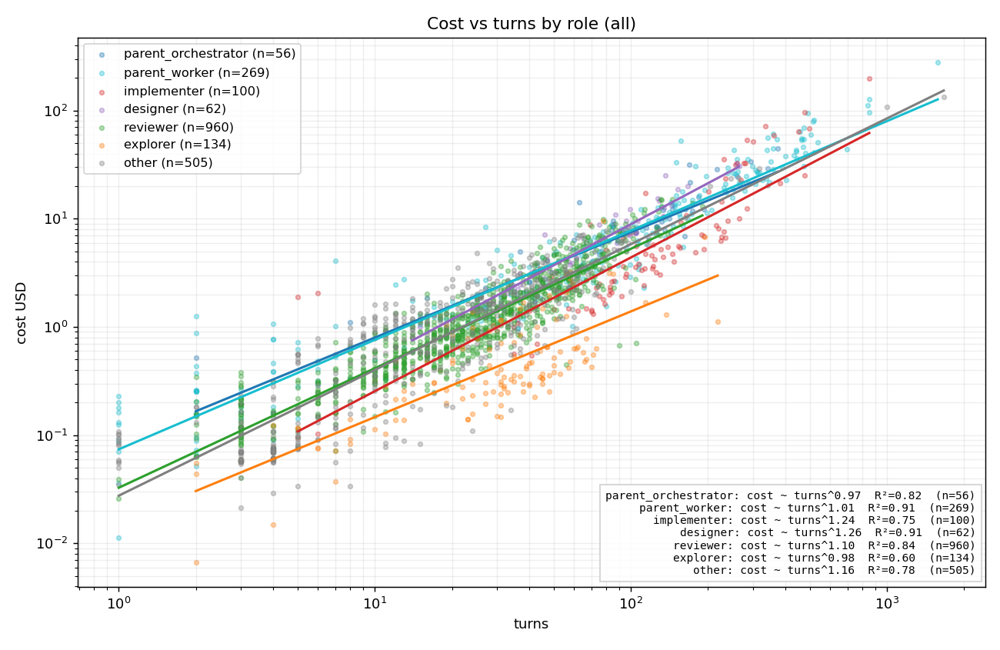

- **parent_orchestrator** cost ~ turns^0.97 (R²=0.82, n=56)
- **parent_worker** cost ~ turns^1.01 (R²=0.91, n=269)
- **implementer** cost ~ turns^1.24 (R²=0.75, n=100)
- **designer** cost ~ turns^1.26 (R²=0.91, n=62)
- **reviewer** cost ~ turns^1.10 (R²=0.84, n=960)
- **explorer** cost ~ turns^0.98 (R²=0.60, n=134)
- **other** cost ~ turns^1.16 (R²=0.78, n=505)

### Component slopes by role

| role                |   cache read |   output |   write 1h |   write 5m |
|:--------------------|-------------:|---------:|-----------:|-----------:|
| designer            |         1.58 |     1.15 |     nan    |       0.98 |
| explorer            |         1.56 |     1.09 |     nan    |       0.78 |
| implementer         |         1.52 |     1.15 |     nan    |       0.84 |
| other               |         1.58 |     1.13 |     nan    |       0.87 |
| parent_orchestrator |         1.64 |     1.1  |       0.49 |     nan    |
| parent_worker       |         1.51 |     1.17 |       0.71 |     nan    |
| reviewer            |         1.7  |     1.08 |     nan    |       0.79 |

### Pooled cost composition by role

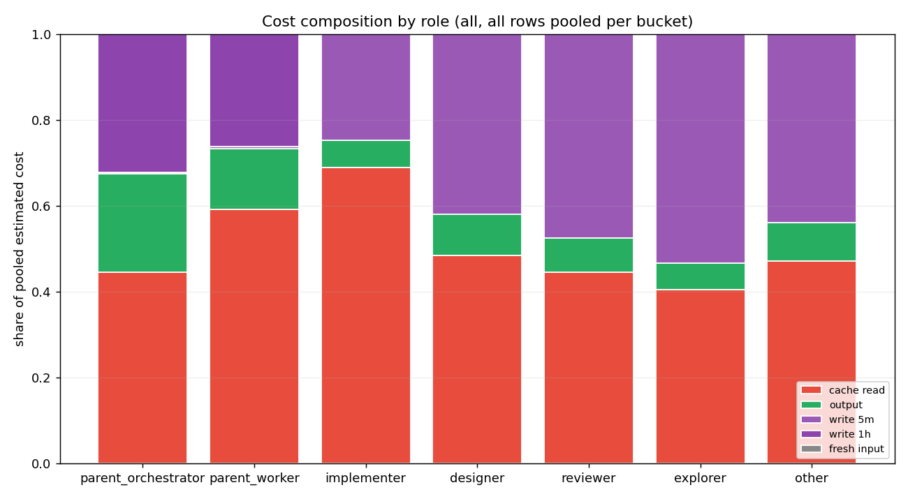

Long-session roles (parent_orchestrator, implementer, parent_worker) carry
higher cache-read share. Short-invocation roles (reviewer, designer) split
more between reads and writes — each invocation re-loads fresh context
(diff + design doc + repo) before doing its work.

## Establishment vs carrying — per-invocation decomposition

For "should I split this work?" questions the useful frame is per-invocation:

- **Establishment** = `input + cache_write_5m + cache_write_1h` (one-time briefing).
- **Carrying** = `cache_read` (recurring re-replay).
- **Productive** = `output` (tokens generated).

Establishment is roughly flat in turns (b ≈ 0.7–0.9); carrying is steeply
superlinear (b ≈ 1.4–1.6). They cross at some `t*`. Below `t*`,
establishment dominates — splitting just multiplies briefings. Above `t*`,
carrying dominates — splitting saves money (modulo per-split orientation
overhead).

### Pooled crossover (all roles, by family)

The highest-N view: every invocation row (parent + every subagent type)
pooled, fit per family. Mixes roles with different establishment-cost
profiles, so the absolute level varies across the cloud, but the
universal `b_carry > b_est` shape and the crossover are clearly visible.

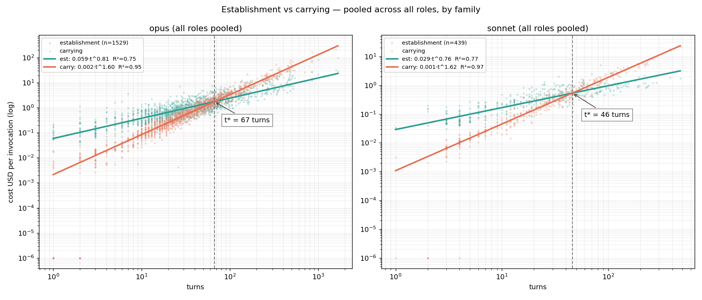

| family   |    n |   b_est |   R2_est |   b_carry |   R2_carry |   t_star |
|:---------|-----:|--------:|---------:|----------:|-----------:|---------:|
| opus     | 1529 |    0.81 |     0.75 |      1.60 |       0.95 |    66.67 |
| sonnet   |  439 |    0.76 |     0.77 |      1.62 |       0.97 |    45.97 |

### Per-cell crossover

Same decomposition broken out by `(role × family)` cell. Smaller N per
cell, but lets you see how each role sits relative to its own break-even
rather than the pooled average.

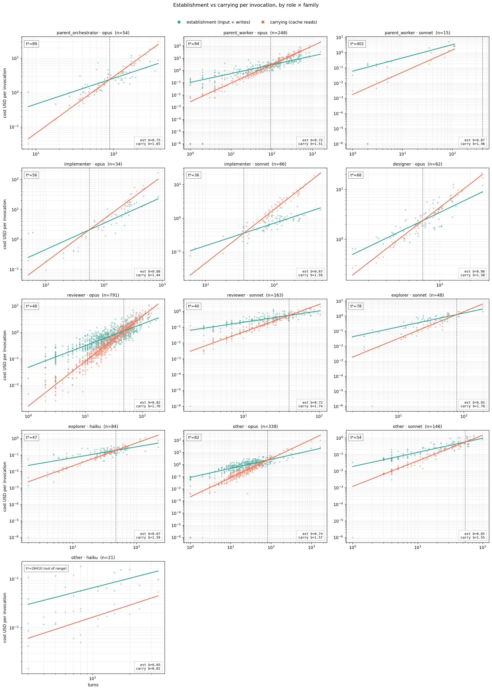

| role                | family   |   n |   b_est |   R2_est |   b_carry |   R2_carry |   t_star |
|:--------------------|:---------|----:|--------:|---------:|----------:|-----------:|---------:|
| parent_orchestrator | opus     |  54 |    0.75 |     0.56 |      1.65 |       0.98 |    89.33 |
| parent_worker       | opus     | 248 |    0.72 |     0.80 |      1.51 |       0.97 |    94.36 |
| parent_worker       | sonnet   |  15 |    0.87 |     0.93 |      1.46 |       0.96 |   402.39 |
| implementer         | opus     |  34 |    0.88 |     0.69 |      1.44 |       0.93 |    56.02 |
| implementer         | sonnet   |  66 |    0.67 |     0.76 |      1.59 |       0.97 |    36.30 |
| designer            | opus     |  62 |    0.98 |     0.67 |      1.58 |       0.96 |    68.43 |
| reviewer            | opus     | 791 |    0.82 |     0.70 |      1.70 |       0.93 |    47.55 |
| reviewer            | sonnet   | 163 |    0.72 |     0.65 |      1.74 |       0.94 |    40.22 |
| explorer            | sonnet   |  48 |    0.93 |     0.78 |      1.78 |       0.92 |    78.22 |
| explorer            | haiku    |  84 |    0.67 |     0.46 |      1.39 |       0.94 |    47.48 |
| other               | opus     | 338 |    0.74 |     0.70 |      1.57 |       0.91 |    82.36 |
| other               | sonnet   | 146 |    0.85 |     0.84 |      1.55 |       0.97 |    54.34 |

*Cells with no plausible crossover (carrying not steeper than establishment within range) — fits are noisy or atypical: other/haiku (n=21).*

Caveat: crossover is a property of *median* invocations under the fits.
Establishment scatter is wide (often two orders of magnitude at any given
turn count), so individual calls can sit far above or below the median.
Treat as a planning heuristic, not a per-call optimum. For non-implementer
roles the crossover is descriptive — the role isn't actually splittable —
but it tells you where each role *sits* relative to its own break-even.

## Implementer focus — the workflow question

The actionable lever: implementers can be split into many short
fresh-context calls or run as one long monolithic call. The crossover
above tells us when splitting starts paying *if* total turns are conserved.

### Implementer cost vs turns by model

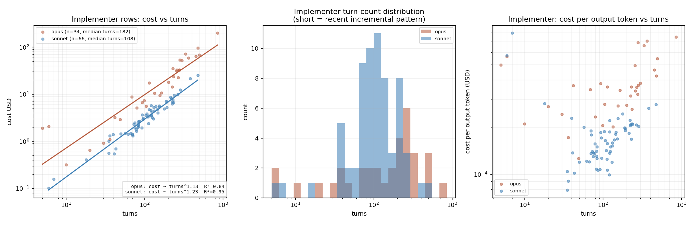

Per-turn cost slope is similar across families (b ≈ 1.1–1.2); the dominant
between-model difference is the price-per-token gap, not session shape.

### Synthetic split-cost model — implementer rows only

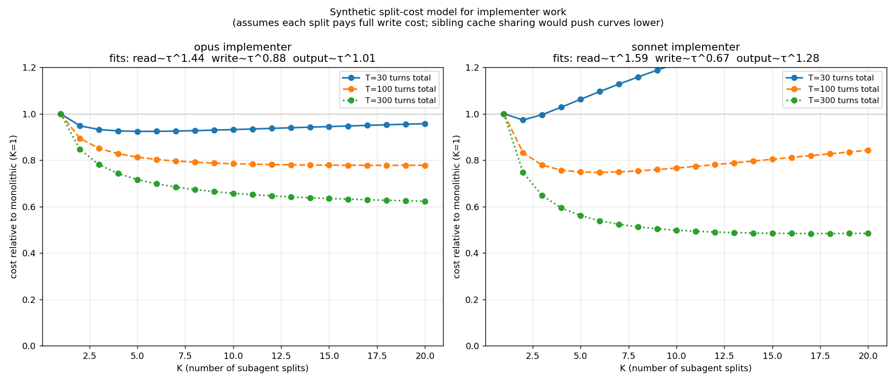

For a hypothetical implementer job needing T total turns split into K
subagents of T/K turns each, this is the predicted total cost vs K, using
power-law fits of each cost component on the implementer rows. Each curve
normalized to the K=1 (monolithic) baseline.

Read: at T=30 splitting barely helps; at T=100, K≈5 saves ~22%; at T=300,
K≈10–15 saves 35–50%.

Load-bearing assumptions: each split pays full cache-write cost (no sibling
prefix reuse — pessimistic), and total turns T is conserved (no per-split
orientation overhead — optimistic). For opus T=100, just 5 extra turns
per split erases the K=5 savings, so predicted savings at smaller T are
conditional on briefings being cheap.

### Same model, all-rows pooled (higher N reference)

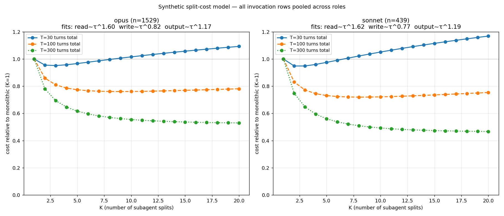

Same synthetic model, fit on every invocation row pooled across roles
(opus and sonnet). Higher N stabilizes the slopes; the assumption that
"all invocations split the same way" is a reach (different roles have
very different briefing sizes), but it's a useful sanity check on the
implementer-only fit. The two views agree on the qualitative shape:
splitting is a wash at small T and pays at large T.

## Per-family summary

| family   |    n |   total_cost_usd |   median_turns |   median_cost |   median_cost_per_turn |   median_cost_per_1k_output |
|:---------|-----:|-----------------:|---------------:|--------------:|-----------------------:|----------------------------:|
| opus     | 1529 |        8158.1925 |        30.0000 |        1.6243 |                 0.0584 |                      0.2733 |
| sonnet   |  439 |         548.4824 |        19.0000 |        0.5426 |                 0.0261 |                      0.1854 |
| haiku    |  118 |          41.7175 |        31.0000 |        0.2804 |                 0.0094 |                      0.0892 |

Output-token-based cost-per-1k-out is included for rough cross-family
calibration only. Output conflates prose, tool-call invocations, and
verbosity, and the per-row cost-per-output-vs-turns trend has R² of 0.04
in this data — task-to-task variation dominates.

## Caveats

- **Tokenizer differences across opus versions** — see above.
- **Role classification is string-matched on `agent_type`** — rare agent
  types fall into `other`.
- **Parent split is a 50% threshold heuristic.** Sessions near the
  threshold get classified somewhat arbitrarily.
- **session_id missing on a small subset** — old extract rows that don't
  appear in any newer file lack session_id; their parents default to
  `parent_worker` (conservative classification).

## Session-level analysis: monolithic vs incremental implementer

> **Sample-size warning.** Of 317 sessions in the merged
> dataset, only 39 follow the implementer/reviewer orchestration
> pattern; the rest are exploration, design review, or one-off Q&A. Within
> those, individual cells (e.g. opus-incremental) can be n≈3. Treat
> numerical conclusions in this section as directional. The large-N
> analyses above are the stronger evidence base.

Sessions are classified by the implementer:slop-reviewer ratio:

- **monolithic** — ratio ∈ [0.5, 1.5]. One big implementer pass per review.
- **incremental** — ratio ≥ 1.5. Many small implementer passes per review.
- **no_slop** — implementers but no slop reviewer (older pattern).
- **other** — no implementer subagents (research / review-only sessions).

### Session counts by mode × dominant model

| mode        |   haiku |   opus |   sonnet |
|:------------|--------:|-------:|---------:|
| incremental |       0 |      3 |       15 |
| monolithic  |       0 |     20 |        0 |
| no_slop     |       0 |      1 |        0 |
| other       |      29 |    113 |       14 |

### Cost-per-output by mode (matched volume)

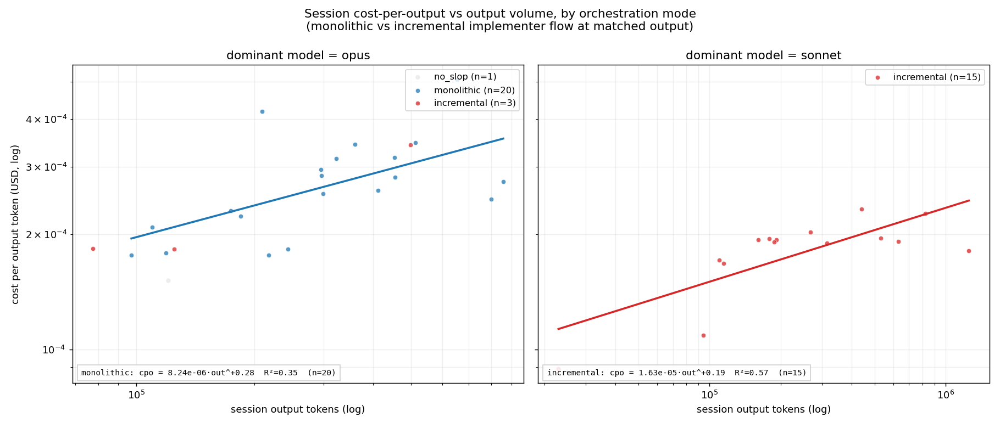

Cost-per-output-token rises with job size (the cache-read tax compounds),
so raw medians are size-confounded. The fit lines control for this by
reading cost-per-output at a common output volume.

Raw medians (NOT volume-controlled):

| family   | mode        |   n |   median_cost_usd |   median_output_tokens |   median_cost_per_1k_out |
|:---------|:------------|----:|------------------:|-----------------------:|-------------------------:|
| opus     | monolithic  |  20 |           87.3091 |                 297486 |                   0.2675 |
| opus     | incremental |   3 |           22.8935 |                 124854 |                   0.1837 |
| opus     | no_slop     |   1 |           18.2773 |                 120684 |                   0.1514 |
| sonnet   | incremental |  15 |           37.2428 |                 192489 |                   0.1920 |

### Direct answer: is incremental cheaper than monolithic at matched output?

Median-level comparison (size-confounded; see fit-line reading):

- **opus**: monolithic median $0.268/1k out (n=20)  vs incremental $0.184/1k out (n=3)  → incremental is 0.69× monolithic (-31%)

The matched-volume reading from the fits collapses most of the apparent
gap. Within opus, monolithic and incremental cost approximately the same
per output token at fixed job size; the apparent saving in raw medians
mostly tracks job-size differences plus the opus→sonnet model swap that's
collinear with incremental in this dataset.

### Per-invocation cost by mode

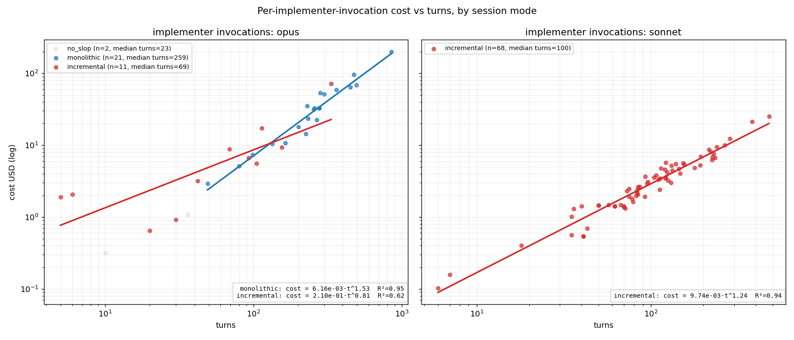

Implementer invocations as scatter, colored by session mode. This
separates "shorter calls in incremental sessions" from "different
cost-per-turn at the same length".

### Empirical split-cost validation

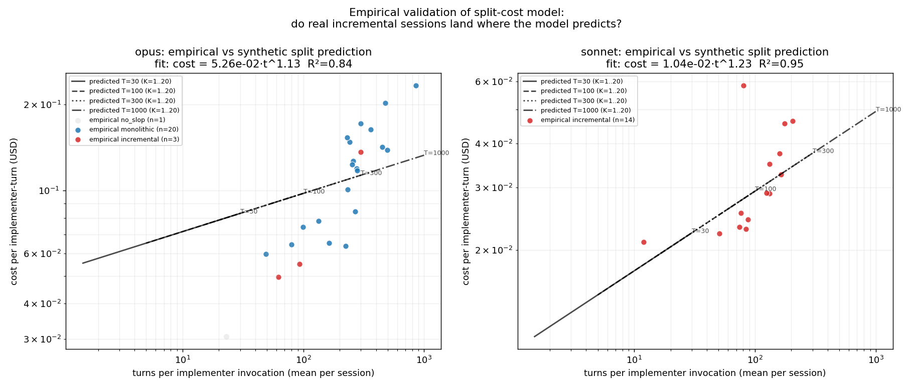

Synthetic prediction (curves, from the power-law fits) against per-session
empirical points (scatter). Each session's mean turns-per-implementer
invocation is the x-coordinate; cost-per-implementer-turn is the y. Shape
is roughly consistent; empirical scatter is wide and the small-N caveat
applies.

### Caveats

- **Small N in classified cells.** Confidence intervals are wide; rank
  order can flip with a few more sessions.
- **Mode is collinear with model** — incremental sessions in the data are
  predominantly sonnet; monolithic are predominantly opus. The
  cost-per-output gap reads as much as a model gap as a workflow gap.
- **Output tokens ≠ useful work.** A 100-token "done" weighs the same as
  a 100-token bug fix.
- **Per-split orientation overhead** isn't directly observable. The
  synthetic split model assumes total turns T is conserved; modest
  per-split overhead can erase predicted savings.
- **Sessions ≠ jobs.** A session may complete more or less work than
  another; cross-mode comparison mixes work amount × orchestration mode
  without ground truth on the work component.

